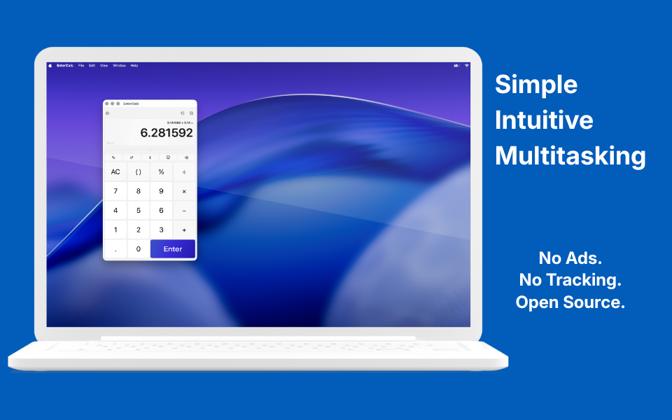
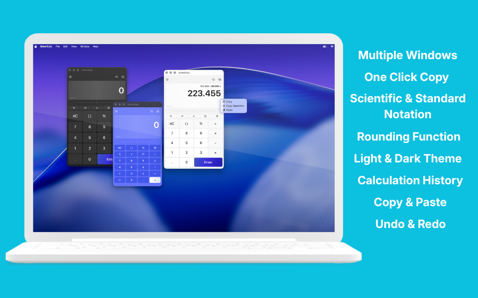

# EnterCalc

A simple calculator with powerful features.

Open source, privacy-first, and designed for speed. EnterCalc is a native calculator for iPhone, iPad, and Mac with history, multitasking, keyboard shortcuts, advanced copy and paste, and zero tracking.

## Photos

## Features

- Multiple calculator panels with independent calculations
- Calculation history with quick result reuse
- Advanced copy, paste, undo, and redo
- One-click copying
- Preserve calculation context when copying and pasting
- Digit-level editing
- Hardware keyboard shortcuts
- Landscape support
- Scientific notation
- Configurable rounding
- Currency symbol handling
- Multiple number formatting styles
- Localization support
- Alternative keyboard layouts
- Light and Dark Mode themes
- Accessibility-focused design
- Privacy-first
- No tracking or analytics
- Open source under the MIT License

## Privacy

EnterCalc operates entirely on your device.

- No tracking
- No analytics
- No accounts
- No advertising

Read the full Privacy Policy:

[Privacy Policy](https://tipliai.github.io/enterCalc/privacy-policy/)

## Open Source

Source code is available on GitHub under the MIT License.

[GitHub Repository](https://github.com/tipliai/enterCalc)

## Support

Need help or want to report a bug?

- [Support Page](https://tipliai.github.io/enterCalc/support/)
- [GitHub Issues](https://github.com/tipliai/enterCalc/issues)

## Documentation

- [Accessibility Features](./accessibility)
- [Keyboard Actions Matrix](./keyboard)